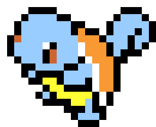

# NES ML

Simple markup language as enty point to learning HTML

▶️ [Preview](https://galymax.github.io/nes-ml/)  
⌨️ [Try it](https://codepen.io/maximDCI/pen/rNKLBgv)

It was originally designed for a one-hour web dev workshop for people with no prior coding experience.

## Concept
Several workshops were conducted using NES.css before NES ML was created. I found that getting used to the XML(HTML) syntax takes longer for people than the time available during a one-hour workshop. That's why NES ML was created to simplify the syntax while still producing for an appealing result.

### Key features
- Tag names based on common terms
- No attributes
- Minimal nesting required
- Lots of pre-defined styling
- Full structured page can be built only using simple tags

## Usage
Include the
- font
- CSS
- JS 
in the `head` of your HTML document

```html
<link href="https://fonts.googleapis.com/css?family=Press+Start+2P" rel="stylesheet">
<link rel="stylesheet" href="./css/styles.css">
<script src="./js/nes-ml.js"></script>
```

- Use the NES ML tags to add content to the page

## Tags
The following tags are available
### `intro`
Same as `box` but all text is centered
```html
<intro>
    Content
</intro>
```


### `box`
Container with a black outline
```html
<box>
    Content
</box>
```


### `box-title`
Title of a `box` or `intro`
```html
<box>
    <box-title>That's me</box-title>
</box>
```


### `message`
Black text box with white text
```html
 <message>Thanks for dropping by, stranger!</message>
```


### `headline`
Big headline
```html
<headline>Content</headline>
```


### `bubble`
Speech bubble
```html
<bubble>Content</bubble>
```


### Avatars
| Tag               | Result        |
| -------------     | ------------- |
| `<ash></ash>`     |  |
| `<mario></mario>` |  |
| `<pokeball></pokeball>` |  |
| `<bulbasaur></bulbasaur>` |  |
| `<charmander></charmander>` |  |
| `<squirtle></squirtle>` |  |
| `<kirby></kirby>` |  |

### Social Media Links
- The url of the link goes between opening and closing tag
- For `twitter`, `whatsapp`, `gmail` and `github` only the handle/email address/phone number needs to be specified, the rest of the url is constructed automatically.

| Tag               | Result        |
| -------------     | ------------- |
| `<twitter>@davidsinclair</twitter>`     |  |
| `<whatsapp>+49123456789</whatsapp>` |   |
| `<github>@galymax</github>` |   |
| `<linkedin>https://www.linkedin.com/in/maxim-werkhowski-b990611bb</linkedin>` |   |
| `<facebook>[profile url]</facebook>` |   |
| `<instagram>[feed url]</instagram>` |   |
| `<gmail>mail@email.com</gmail>` |   |
| `<youtube>[channel url]</youtube>` |   |
| `<twitch>[profile url]</twitch>` |   |
| `<reddit>[profile url]</reddit>` |   |

### `progress-[0-100]`
Progress bar with title
- `progress-` tags exist in variants from `<progress-0>` to `<progress-100>` in steps of `1`
```html
<progress-95>JavaScript</progress-95>
```


## Compatibility
Tested on
- Chrome ✔
- Firefox ✔
- Safari ✔
- Edge ✔

## How it works
- Styling is based on [NES.css](https://nostalgic-css.github.io/NES.css/)
- The language takes advantage of HTML5's freedom to use custom tag names